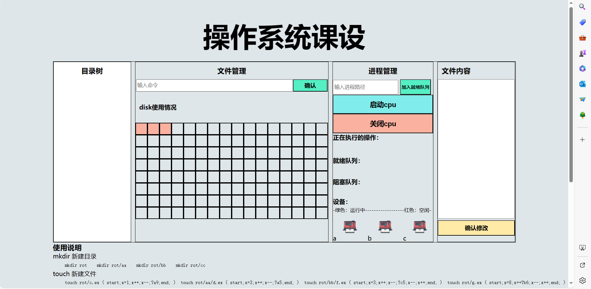

# OS-course-design
hbu操作系统课程设计

# 效果图  
  

# 一些说明
 
顺序遍历  
0，1，2文件名字  
3，4拓展名  
5 目录还是文件， 1为目录，0为文件  
6 起始块号  
7 文件长度   
-1 为文件结束链接标志  
文件名，最长3个字母，拓展名2字母  

说明：  
目录和文件要一层一层件，不能跳越，方法也不一样touch和mkdir  
会根据要求，创建真实的文件夹在项目中，但是不包含内容，只作为文件结构展示，当然模拟的disk中也会创建。  
名字最长3字母 拓展名最长为2字母  
写文件名字的时候要加上拓展名  
mkdir 新建目录 1  
touch 新建文件 1  
cat查看文件   
rm可以删除文件和目录 1  
cp 拷贝文件，要拷贝有效文件 1  
mv 移动文件 要移动有效文件 1  

有些地方完全可以避免重复代码，但是我懒得写了，能实现效果就行  

设备管理思路没做好，可以自行修改  